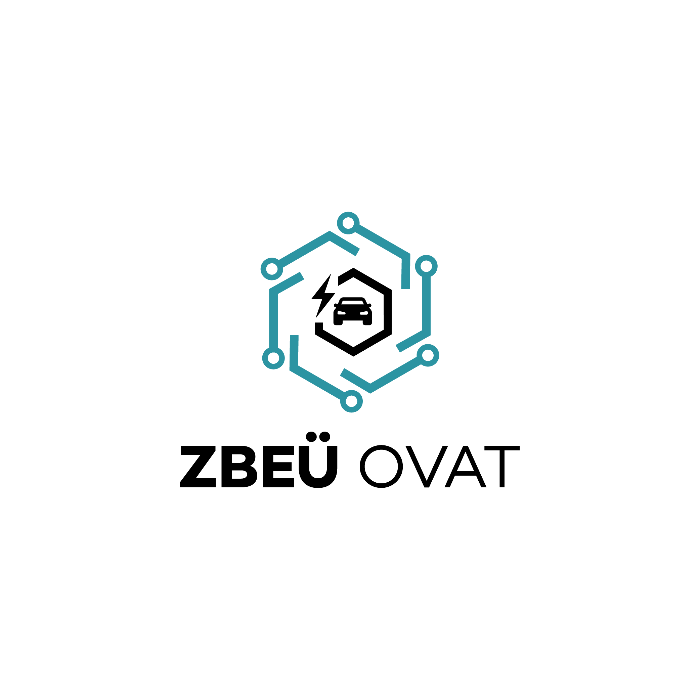
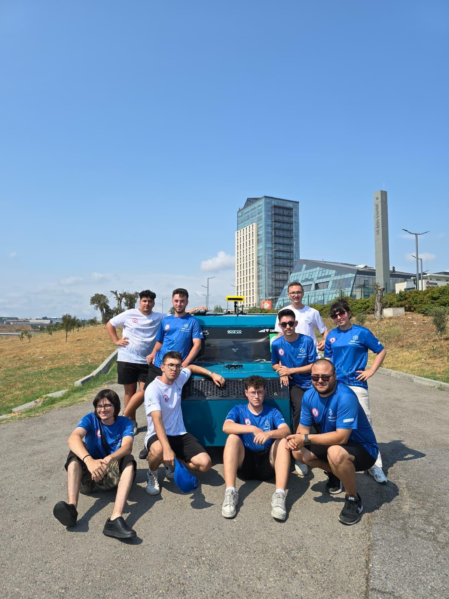

<!-- Logo buraya eklenecek — assets/logo.png olarak repo'ya yükleyin -->

# OVAT — Otomasyon ve AR-GE Takımı

**Zonguldak Bülent Ecevit Üniversitesi**

---

*Gerçek trafik senaryolarında güvenli ve kararlı şekilde hareket edebilen bir sürücüsüz araç prototipi geliştiriyoruz.*

## 🚗 Proje Hakkında

OVAT, **Teknofest Robotaksi — Binek Otonom Araç Yarışması** kapsamında sürücüsüz bir kara aracı sistemi geliştiren bir üniversite takımıdır. Aracımız; çevresel algılama, rota planlama, konum takibi ve engel aşma gibi görevleri insan müdahalesi olmaksızın gerçekleştirebilecek şekilde tasarlanmıştır.

## 🛠️ Sensör ve Donanım Altyapısı

| Bileşen | Model |
|---|---|
| 🎥 Stereo Kamera | 2× ZED2 |
| 📡 3D LiDAR | Robosense Helios H32F70, Velodyne VLP-16 |
| 🛰️ RTK GPS | Here3+ RTK |
| 🧭 IMU | Witmotion WT901C |
| 🎛️ Kontrol Kartı | Teensy 4.1 |

## 👥 Takımımız

<!-- Takım fotoğrafı buraya eklenecek — assets/team.jpg olarak repo'ya yükleyin -->

 

## 🔗 İletişim

<!-- Aşağıdaki linkleri kendi hesaplarınızla güncelleyin -->

---

**OTOMASYON VE AR-GE TAKIMI © 2019-2026**

